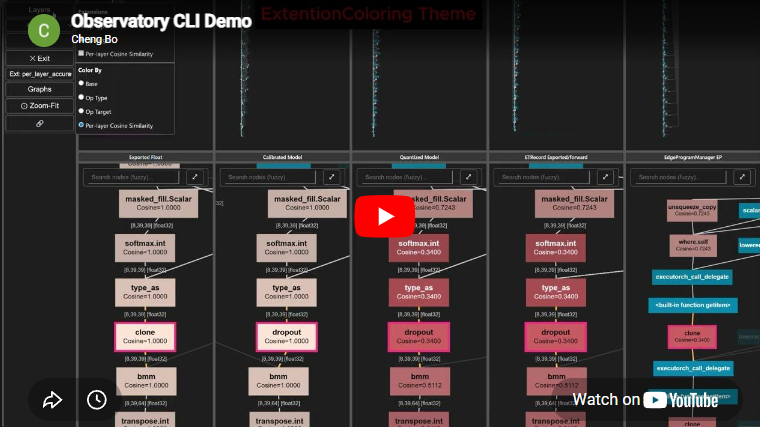

# `fx_viewer`

## Lightweight FX Graph Viewer for Compile-Pipeline Debugging

ExecuTorch `devtools/fx_viewer/` · RFC #21068

---

## What is `fx_viewer`?

- Self-contained FX graph viewer → **standalone HTML output**
- Debug model across **multiple compile stages** at once
- Automatic cross-graph node sync
- Programmatic analysis overlay (color, labels, tooltips)
- **Complementary** to Model Explorer, not a replacement

---

## Video Walkthrough

> ⚠️ Start at **0:21** — the CLI shown in the first 20s is Observatory (RFC-B), not fx_viewer.

[](https://youtu.be/NQuj-2LvhAc?t=21)

---

## 5 Gaps in Existing Visualization

| # | Gap | Impact |
|---|-----|--------|
| 1 | Max 2 graphs at once | Lose context across 3+ stages |
| 2 | Manual mapping file for node sync | Tedious, breaks after passes |
| 3 | No custom overlay on graph | Analysis stuck in tables |
| 4 | Server required to view | Can't share / attach to CI |
| 5 | External team owns viewer | Can't iterate quickly |

---

## Gap 1 — N-Way Graph Compare

- **Need:** View float → quantized → edge → device simultaneously
- **Model Explorer:** 2-pane only
- **fx_viewer:** N-way grid, one HTML file

```python
FXGraphCompareExporter(OrderedDict([
    ("Float",     FXGraphExporter(float_gm)),
    ("Quantized", FXGraphExporter(quantized_gm)),
    ("Edge IR",   FXGraphExporter(edge_gm)),
])).export_html("compare.html")
```

---

## Gap 1 — Demo

[](https://quic-boyuc.github.io/Executorch_Observatory_Demo/generated_reports/fx_viewer/etrecord_compare_xnnpack/mv2_etrecord_compare_xnnpack.html)

[Live: MV2 XNNPACK ETRecord compare (2-pane)](https://quic-boyuc.github.io/Executorch_Observatory_Demo/generated_reports/fx_viewer/etrecord_compare_xnnpack/mv2_etrecord_compare_xnnpack.html)

---

## Gap 2 — Automatic Node Sync

- **Need:** Click node in quantized → highlights in float/edge/device
- **Model Explorer:**
  - "Match node id" — breaks after quantization/lowering
  - Manual mapping JSON — you produce & upload it yourself
- **fx_viewer:** Automatic many-to-many sync
  - Uses PyTorch `from_node` metadata (set by `ExportPass`)
  - Fallback chain: `from_node_root` → `debug_handle` → node id

---

## Gap 2 — Demo

[](https://quic-boyuc.github.io/Executorch_Observatory_Demo/generated_reports/fx_viewer/three_graph_compare/demo_3graph_compare.html)

[Live: 3-graph sync (decompose 1→many, fuse many→1)](https://quic-boyuc.github.io/Executorch_Observatory_Demo/generated_reports/fx_viewer/three_graph_compare/demo_3graph_compare.html)

---

## Gap 3 — Programmatic Analysis Overlay

- **Need:** Color nodes by accuracy, show metrics as labels on graph
- **Model Explorer limitations:**
  - Adapter exposes only edge dialect graph (single graph)
  - Requires separate JSON + GUI upload
  - `devtools/visualization/` wrapper doesn't expose it at all
  - Overlay scoped to single graph only
- **fx_viewer:**
  - Any node, any graph
  - Color rules + labels + tooltips
  - Baked into HTML at export time

---

## Gap 3 — Demo

[](https://quic-boyuc.github.io/Executorch_Observatory_Demo/generated_reports/fx_viewer/etrecord_compare_xnnpack/mv2_etrecord_compare_xnnpack.html)

---

## Gap 4 — Standalone HTML, No Server

- **Model Explorer:** Live server or JSON that needs server to open
- **fx_viewer:**
  - Single `.html` file — works offline
  - Shareable: GitHub issue, email, CI artifact
  - **Embeddable:** `export_js(container_id)` mounts viewer in any DOM element

---

## Gap 5 — In-Tree, Modifiable

| | Model Explorer | fx_viewer |
|---|---|---|
| Stack | Angular + three.js (~50k LoC) | Plain JS on Canvas (~4.5k LoC) |
| Owner | External team | ExecuTorch devtools |
| Add feature | Upstream PR + wait | Normal ExecuTorch PR |
| Layout | Browser-computed | Python pre-computed |

---

## Positioning — When to Use Which

| Scenario | ME | fx_viewer |
|---|:---:|:---:|
| Browse model structure | ✅ | — |
| nn.Module hierarchy | ✅ | — |
| Multi-stage compare | — | ✅ |
| Accuracy overlay | ⚠️ | ✅ |
| Attach to GitHub/CI | — | ✅ |
| Extend for your backend | — | ✅ |

**Both tools coexist.** Different jobs.

---

## Arm's `executorch-extension-model-explorer`

| | Arm Extension | fx_viewer |
|---|---|---|
| Target | Deploy artifact (.pte, ETDump) | Compile-time debugging |
| Graphs | Edge dialect only (1 graph) | N graphs with auto sync |
| Overlay | Runtime latency | Any data (accuracy, latency, partition) |
| Output | Requires ME server | Standalone HTML |

`fx_viewer` covers the same use cases + adds multi-graph compare, auto sync, standalone HTML.
Arm's extension additionally provides ME's hierarchical layer browsing UI.

---

## Feature Matrix

| Feature | ME wrapper | Raw ME | fx_viewer |
|---|:---:|:---:|:---:|
| N-graph compare | ❌ | 2 | N |
| Auto node sync | ❌ | manual | ✅ |
| Custom overlay | ❌ | ✅ (limited) | ✅ |
| Standalone HTML | ❌ | ❌ | ✅ |
| Embeddable JS | ❌ | ❌ | ✅ |
| In-tree | ❌ | ❌ | ✅ |
| Module hierarchy | ❌ | ✅ | ❌ |

---

## Live Demos (open in any browser)

- [MV2 XNNPACK (2-pane)](https://quic-boyuc.github.io/Executorch_Observatory_Demo/generated_reports/fx_viewer/etrecord_compare_xnnpack/mv2_etrecord_compare_xnnpack.html) — Aten → Edge, backend overlay
- [MV2 QNN (3-pane)](https://quic-boyuc.github.io/Executorch_Observatory_Demo/generated_reports/fx_viewer/etrecord_compare_qnn/mv2_etrecord_compare_qnn.html) — Aten → Edge After Transform → Edge
- [3-Graph Sync](https://quic-boyuc.github.io/Executorch_Observatory_Demo/generated_reports/fx_viewer/three_graph_compare/demo_3graph_compare.html) — decomposition & fusion sync

---

## Future Work

- **QNN backend graph** — device-side graph as additional pane
- **Pure-Python layout** — replace `fast-sugiyama`, remove external dep
- **Runtime delegated accuracy** — on-device per-layer comparison

---

## Open Questions

- **Q1:** Module location — `devtools/fx_viewer/` or under `visualization/`?
- **Q2:** Extension surface for non-FX graph formats?
- **Q3:** Add `export_fx_viewer_html_from_graphs(...)` to Inspector?
- **Q4:** Expose JSON payload as stable public API?
- **Q5:** Formalize JS embedding API as stable contract?

---

<!-- _class: lead -->

# Appendix: Observatory (RFC-B)

## Modular Debugging Workflow Framework

---

## Observatory — The Problem

Backend debugging is **fragmented:**

- Per-layer accuracy → custom script, results in console
- HTP profiler → separate tool, separate tutorial
- ADB logs → copy-paste between terminals
- Regression detection → re-run compiler, diff manually

**No standard interface.** No unified output format.

---

## Observatory — Motivation

| Need | Current (Inspector + scripts) | Observatory |
|---|---|---|
| Multi-backend tools | Each backend writes scripts | Unified Lens interface |
| Custom analysis output | Console / CSV / screenshots | Unified HTML report |
| Cross-run comparison | Re-run everything | Archive JSON → offline compare |
| Setup complexity | ETRecord + Config + Inspector + … | Enable Lens → run → done |
| New debug capability | Extend Inspector API | Add a Lens (plugin) |

---

## Observatory — Design Principles

- **Does not replace** ETRecord / ETDump / Inspector
  - Uses them as data sources
  - Extra results go through Lens → Archive JSON
- **Lens = plugin, not core**
  - Backend teams own their Lenses
  - Adding capability = adding a file, not modifying core
- **Offline re-analysis**
  - Archive separates captures from results
  - Re-analyze same data with different Lens configs

---

## Observatory — Architecture

```
┌─────────────────────────────────────────┐
│ Observatory (coordination layer)         │
│                                          │
│  Lens A    Lens B    Lens C    ...      │
│  accuracy  profiler  ADB logs           │
│     │         │         │                │
│     ▼         ▼         ▼                │
│  ┌────────────────────────────────────┐  │
│  │ Archive JSON → Report HTML        │  │
│  │ (embeds fx_viewer graphs)         │  │
│  └────────────────────────────────────┘  │
└──────────────────────────────────────────┘
       ▲ uses (does not replace)
┌──────┴──────────────────────────┐
│ ETRecord / ETDump / Inspector   │
│ (unchanged)                     │
└─────────────────────────────────┘
```

---

## Observatory — fx_viewer Integration

- Lens produces graph-level analysis (e.g. per-node PSNR)
- Results become `GraphExtension` overlays
- Observatory calls `fx_viewer` to render graph + overlays
- Final HTML report contains embedded interactive viewer

**Both work standalone:**
- fx_viewer: direct Python API → HTML
- Observatory: tables/charts without graphs

**Together:** Lens → overlay → interactive graph report

---

## Observatory — Demo

[qualcomm/mobilenet_v2 report](https://quic-boyuc.github.io/Executorch_Observatory_Demo/generated_reports/qualcomm/mobilenet_v2/observatory_report.html)

```bash
observatory run --lens accuracy examples/qualcomm/mobilenet_v2.py
```

- Captures graphs at each compile stage
- Computes per-node accuracy
- Renders 4-way graph with color overlay
- One standalone HTML file

---

## Summary

| | fx_viewer (RFC-A) | Observatory (RFC-B) |
|---|---|---|
| **What** | Graph viewer | Workflow framework |
| **Value** | N-way compare + sync + overlay + HTML | Lens plugins + archive + report |
| **Independent?** | ✅ | ✅ |
| **Together** | Observatory embeds fx_viewer with Lens overlays |
| **Replaces** | Nothing | Nothing |

---

## Thank You

- **RFC:** [#21068](https://github.com/pytorch/executorch/issues/21068)
- **Video:** [youtu.be/NQuj-2LvhAc](https://youtu.be/NQuj-2LvhAc) (start 0:21)
- **Demos:** Open links in any browser — no install

Feedback welcome!
