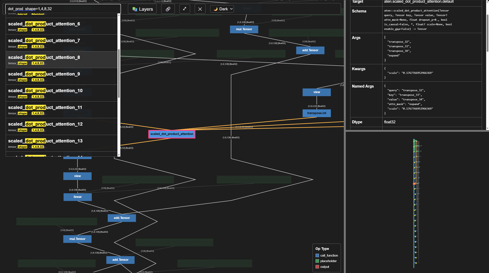

# RFC: Observatory — A Workflow Coordinator and Visual Synthesis Layer for ExecuTorch Debugging

**Status:** Proposed / Under Discussion  
**Audience:** ExecuTorch maintainers, backend owners, devtools reviewers  
**Scope:** Add `devtools/observatory/` and `devtools/fx_viewer/` as shared ExecuTorch debugging infrastructure

> **Positioning note for reviewers:** Observatory is not a replacement for `ETRecord`, `ETDump`, `Inspector`. It is a coordination layer that sits above them.

> **Abstract:** Every ExecuTorch backend team today writes its own bespoke scripts to sequence the same five debugging steps — instrument, configure, export, analyze, visualize. Observatory eliminates that duplication. It provides the missing coordination layer above existing capture primitives: one zero-config command captures compile-time graph snapshots across AOT stages, a formal Lens protocol lets backends contribute analysis logic once rather than per-script, and the framework synthesizes everything into a single portable artifact — an interactive HTML report for humans, or structured JSON for CI and LLM triage. The result: debugging workflows that were previously 200-line ad-hoc scripts become a one-liner, outputs that were fragmented CSVs and terminal prints become a sharable, structured, reproducible record.

---

## 1. Summary

Debugging ExecuTorch backend issues often means collecting many things by hand. An engineer may save graph dumps, logs, and accuracy numbers in separate files. Those files are hard to share with another team, and hard to reproduce later.

This RFC proposes two new components under `devtools/` to address this.

---

**Observatory** replaces fragmented per-backend debug scripts with one shared debugging surface. It standardizes two things:

**How engineers invoke debugging — three entry points, from easiest to most flexible:**

- **CLI** — run your existing model script through Observatory. Your script does not change; Observatory records the whole run from outside.
- **Decorator** — add `@observe_pass` above a compiler pass class (`PassBase` subclass). Observatory records the FX graph before and after each time the pass runs.
- **Context manager** — wrap a `with Observatory.enter_context(...)` block around the code you want to inspect, and call `Observatory.collect(name, artifact)` for the objects you want recorded. This is the manual surface when you need exact control; the CLI and decorator are built on top of it.

**Where backend-specific logic attaches — four lifecycle stages:**

- **Instrument** — patch compilation and runtime to collect evidence.
- **Serialize** — write that evidence into a portable archive.
- **Analyze** — run pluggable Lenses over the archive.
- **Visualize** — render results for humans and machines.

A backend author writes their analysis once at the stages they care about. Write once, run on any archive, share with any team.

---

**`fx_viewer`** is a JavaScript library for embedding interactive FX graph views into any HTML page or debugging report. It embeds graph layout and debugging data as JSON layers in a single HTML file — each Observatory Lens can contribute its own overlay, and the result opens instantly in any browser without a server.

- **Embeddable** — drop into any HTML page or `<div>`; graph data is compressed and embedded as JSON in the file. The JavaScript API allows external control of node hovering, selection, and viewport actions.
- **Instant rendering** — layout is computed in Python before export. Other tools calculate layout in the browser on load, which is slow for large graphs. `fx_viewer` opens a 10k-node graph instantly.
- **Simplicity** — ~4k lines of plain JavaScript, no framework dependencies. Easy to read, modify, or embed anywhere.
- **Extensible data layers** — any debugging signal can be overlaid directly on graph nodes: accuracy gradients, partition boundaries, profiling numbers, quantization parameters. Each layer is added via the Python extension API (`GraphExtension`) and rendered independently, so multiple tools can paint on the same graph without conflict.

---

The rest of this RFC develops these claims. §2 details the pain. §4 walks through three personas and both axes. §5 specifies the architecture and Lens protocol. §6 covers `fx_viewer`.


---

## 2. Motivation & Problem Statement

As ExecuTorch backend compilation pipelines grow in complexity, debugging compiler passes and hardware-specific lowerings has become increasingly painful. Two primary frictions compound across backends, artifact types, and development teams:

### 2.1 The Debugging Workflow is Fragmented
Debugging is a five-stage workflow: **instrument** the run, **configure** it, **export** captured artifacts, **analyze** metrics/differences, and **visualize** the results.

ExecuTorch’s existing devtools provide excellent primitives for raw capture. In particular, the `Inspector` and `ETRecord`/`ETDump` APIs offer a great primitive interface for dumping arbitrary runtime binary blobs, leaving the backend and developer to design their own interpretation logic in Python scripts. However, because there is no common framework to manage the execution scripts, configuration, and data-synthesis workflow *around* these Inspector outputs, we see a fragmented tooling landscape:
*   **No Shared Lifecycle Contract:** Because there is no common session model, backends must build bespoke wrapper scripts (e.g., `qnn_intermediate_debugger.py` on Qualcomm, and separate equivalents for XNNPACK) that manually sequence: configure Inspector, invoke the compiler, collect raw activation blobs at the right pipeline stages, run accuracy simulations, and parse binary data. Each script reinvents the same lifecycle logic — when to start, when to collect, when to stop, how to clean up — with no shared contract and no reuse across backends.
*   **No Extension Common Ground:** There is no shared place for a backend team to plug in specialized analysis logic, meaning the code that interprets Inspector raw data cannot be reused across different backends.
*   **No Graph-Anchored Visual Correlation:** Inspector natively correlates runtime ETDump events with the final Edge Dialect graph via `debug_handle`, and exposes this as pandas DataFrames. However, there is no shared layer that (a) captures the intermediate FX graph states at `prepare_pt2e` and `convert_pt2e` — stages that are not stored in ETRecord and are invisible to Inspector — and (b) synthesizes Inspector's runtime correlation data together with these compile-time snapshots into a single visual, interactive report. Developers are left to write Python scripts to interpret DataFrames, with no graph-anchored visual representation.
*   **No Multi-Concern Synthesis:** Even when individual analyses succeed, their outputs remain in disconnected formats — console prints, ad-hoc CSVs, static screenshots. There is no shared layer that combines accuracy data, partition assignments, stack trace provenance, and graph structure into a single navigable view for human review or systematic CI parsing.

### 2.2 The Graph Has No Workflow-Aware Viewer
The `torch.fx` graph module is the core IR for ExecuTorch lowering, yet developers have no easy way to interact with it in-pipeline:
*   **Deployment Barriers:** Current visualization tools (such as Model Explorer integrations) often require a local web server, preventing easy embedding in standalone files or sharing in discussion threads.
*   **Visual Signal Isolation:** Graphs are the most natural visual anchor for debugging information. However, without a shared, layered viewer, developers must look at different dashboards to see accuracy loss, partition assignments, and hardware constraints. 

Observatory and `fx_viewer` address these gaps by providing a unified user surface, a shared extension protocol (**Lenses**), and a server-free, layered graph renderer.

### 2.3 Boundaries and Relationship with Existing Tools
Observatory does not replace existing ExecuTorch runtime capture or analysis primitives — it is a client of them. It is a **workflow lifecycle coordinator and visual synthesis layer** that wraps around them:
*   **`ETRecord` / `ETDump` / `Inspector`:** Inspector natively correlates runtime ETDump events with the final Edge Dialect graph via `debug_handle` and exposes this as DataFrames. Observatory lenses can consume Inspector's correlated output and synthesize it — together with intermediate compile-time graph snapshots that Inspector cannot access — into visual, interactive overlays on the FX graph canvas.
*   **Complementary and Non-Overlapping Scope:** Inspector specializes in *runtime event capture, `debug_handle`-to-graph-node correlation, and per-operator numerical gap analysis* — all exposed as DataFrames for programmatic use. Observatory specializes in three areas Inspector does not address: *capturing intermediate compile-time graph snapshots* (pre-ETRecord stages invisible to Inspector), *active zero-config workflow coordination* (forcing `generate_etrecord=True`, managing pipeline region structure), and *visual synthesis* (transforming DataFrames and graph snapshots into a portable, interactive HTML report).

#### Tool Positioning Comparison

| Feature / Property | `ETRecord` / `ETDump` | `Inspector` | `devtools/visualization/` | **Observatory** + **fx_viewer** |
|---|---|---|---|---|
| **Primary role** | AOT artifact storage; runtime trace capture | Post-hoc analysis of ETDump + ETRecord files | Interactive model structure browser | Live workflow coordinator + visual synthesis layer |
| **Lifecycle** | During export / during runtime | After the run (file-based constructor) | After export | During compilation (live session) |
| **Input** | ExportedProgram, runtime binary blobs | ETDump file + ETRecord file | ExportedProgram / EdgeProgramManager | Any artifact type via `collect()` |
| **Output** | Binary files (`.etrecord`, `.etdump`) | DataFrames, tabular text, numeric gap | Web server + browser tab | Self-contained HTML + Archive JSON + Report JSON |
| **Extension model** | None | `delegate_metadata_parser` callback | `add_node_data()` + regex JSON | Lens protocol (8 methods, full lifecycle) |
| **Embeddable in report** | No | No | No (opens own tab) | Yes (first-class) |
| **Cross-stage comparison** | No | AOT vs. runtime (single pair) | No | N-way, any stages, any backends |
| **CI-friendly output** | Binary blobs | DataFrames (not CI-native) | Not supported | Archive JSON + Report JSON (structured, diffable) |
| **Replaces any of the above?** | — | No | No | **No** |

---

## 3. Goals and Non-Goals

### Goals
*   **Shared Lifecycle and Extension Contract:** Define a lightweight protocol (**Lens**) allowing backend teams to encapsulate one debugging concern — including how to configure existing `Inspector`/`ETRecord` primitives, when to collect artifacts, how to analyze the results, and how to render them — once, and have the framework handle session management, archive storage, and report assembly automatically.
*   **Unified Invocation:** Support zero-code-change CLI execution, nested Python context managers, and pass-level decorators.
*   **Portable Outputs:** Produce a single, self-contained, server-free HTML file for human review, and a structured Archive JSON for archival and regression comparison.
*   **Layered Graph Visualizations:** Embed an interactive, canvas-based FX graph renderer (`fx_viewer`) supporting dynamic overlays and synchronized multi-graph comparison views.

### Non-Goals
*   **Replacing or Extending Inspector/ETRecord:** Observatory defines no new binary capture formats, no new runtime instrumentation hooks, and no new ETDump/ETRecord schemas. All raw data capture continues to flow through `ETRecord`, `ETDump`, and `Inspector` exactly as today. Observatory's only new code is the coordination and synthesis logic that sits above these primitives, consuming them as clients through lenses. The capture primitives remain owned and governed by their existing maintainers.
*   **Unifying Hardware Schemas:** It does not force backends into a single runtime trace schema. Backends define their own data representations inside their respective lenses.
*   **Live Profiling Stream:** The focus is on offline, post-run report generation and CI/regression comparison rather than real-time streaming telemetry.

---

## 4. Proposed User-Facing Capabilities & Working Demos

Observatory connects raw data capture and visual analysis. This section walks through three real developer roles, with live compilation and triage demos for each.

> **💡 Key Vocabulary & Mental Models**
> To assist first-time readers in skimming this section, here are the core concepts of the Observatory architecture (fully defined in **§5.1**):
> *   **Session:** One complete debugging run from start to finish.
> *   **Region:** A named, logical scope used to group and nest captures (like a folder, e.g., `preprocess/` or `lowering/`).
> *   **Record:** One individual captured artifact (e.g., a single FX graph snapshot) inside a Session.
> *   **Archive (JSON):** The raw, persisted, unrendered data file saved from a Session.
> *   **Report (HTML / JSON):** The derived, analyzed output (either an interactive HTML dashboard for humans, or a structured JSON summary for machines and LLM gates).
> *   **Lens:** A plug-in class that handles a single debugging concern (e.g., compile-time accuracy or metadata).
>
> *Note: An Observatory **Record** is a compile-time snapshot inside a Session, and is completely unrelated to ExecuTorch's **ETRecord** file, which is a serialized compilation package.*

---

### 4.1 Three Real-World Use Cases & Walkthrough Demos

#### A. Backend Debug-Logic Maintainer
*   **Goal:** Ship per-layer accuracy debugging logic once, and have it work uniformly across all backends.
*   **Today (The Pain):** ExecuTorch's `Inspector` provides `calculate_numeric_gap()` for AOT-vs-runtime comparison, but using it requires writing manual Python scripts. Furthermore, Inspector's analysis is limited to the final Edge Dialect graph stored in `ETRecord` — it cannot see or compare accuracy across intermediate AOT compile-time stages (like `prepare_pt2e` and `convert_pt2e`) because those graph states are not stored in `ETRecord`. Each backend team must write its own wrapper scripts (e.g., Qualcomm's `qnn_intermediate_debugger.py`), ending up with disconnected CSVs and console logs rather than a unified visual report.
*   **With Observatory:** A backend owner writes a single `Lens` class to intercept and analyze intermediate stages. The framework automatically coordinates session lifecycles, collects snapshots, and generates reports. The CLI execution command is completely unified across backends.

> **⚠️ Note on Demo Scope:** The walkthrough video and current draft PR demonstrate **compile-time AOT accuracy simulation** (CPU-simulated metrics over AOT FX graph stages like `prepare_pt2e` and `convert_pt2e`). Real on-device runtime execution accuracy (which maps ETDump binary data on the device back onto the final Edge Dialect graph using `debug_handle` + `Inspector`) is a planned, targeted scope in the post-RFC roadmap and is not shown in this specific compile-time demo.

* **Zero-Config CLI Walkthrough:** 
  You can run Observatory with zero code changes over any existing compiler or model script. For instance, to capture compiler stages and accuracy simulation on Qualcomm's HTP backend:

  ```bash
  pip3 install 'fast-sugiyama[full]'   # Python >= 3.11

  python -m executorch.backends.qualcomm.debugger.observatory \
      --output-html obs_report.html \
      --lens-recipe accuracy \
      examples/qualcomm/oss_scripts/mobilevit_v2.py \
      --backend htp --model SM8650 -d ./imagenet-mini-val/ \
      -b build-android/ --compile_only
  ```

  *Note: A `lens-recipe` is a named preset bundle of active lenses. For example, `accuracy` enables the per-layer accuracy lens plus its core dependencies.*

  To run the equivalent command for XNNPACK, simply use `python -m executorch.backends.xnnpack.debugger.observatory` and swap the script and flags. The CLI structure remains identical.

* **Demonstration Videos:**
  * **Video 1 (Walkthrough):** A video walkthrough of the zero-config script, complete observatory report entries, and interactive `fx_viewer` features is available in this repository at: [walkthrough_from_issue.mp4](demo_material/walkthrough_from_issue.mp4).
  * **Video 2 (Local High-Resolution Master):** A high-resolution copy of this video is also hosted locally on the supervisor's system at: `C:\Users\boyuc\OneDrive - Qualcomm\Desktop\Observatory_Final1_x264_12fps.mp4` (accessible on WSL at `/mnt/c/Users/boyuc/OneDrive - Qualcomm/Desktop/Observatory_Final1_x264_12fps.mp4`).

* **Interactive HTML Output Elements:**
  * **Session Dashboard:** Displays metadata of the run (command line arguments, active environment, models, and registered lenses).
    
    

  * **Interactive Layered Graph:** Click any stage to inspect nodes, pan, zoom, or search. Click any node to instantly view compiler metadata, stack trace provenance, and simulated per-operator execution metrics (cosine similarity, PSNR, MSE) visualized as a color gradient directly on the canvas.
    
    

* **Pre-Generated Single-Run Demo Reports:**
  These reports showcase individual, backend-specific runs. Lenses active here include `metadata`, `stack_trace`, `graph`, `accuracy`, and `per_layer_accuracy` (compile-time simulation).
  
  | Backend | Model | Nodes | Report | JSON Summary | Log |
  |---|---|---:|---|---|---|
  | xnnpack | `mobilebert` | 2361 | [HTML Report](https://quic-boyuc.github.io/Executorch_Observatory_Demo/generated_reports/xnnpack/mobilebert/observatory_report.html) | [Summary JSON](https://quic-boyuc.github.io/Executorch_Observatory_Demo/generated_reports/xnnpack/mobilebert/observatory_report.summary.json) | [Raw Log](https://quic-boyuc.github.io/Executorch_Observatory_Demo/generated_reports/xnnpack/mobilebert/run.log.txt) |
  | xnnpack | `resnet50` | 550 | [HTML Report](https://quic-boyuc.github.io/Executorch_Observatory_Demo/generated_reports/xnnpack/resnet50/observatory_report.html) | [Summary JSON](https://quic-boyuc.github.io/Executorch_Observatory_Demo/generated_reports/xnnpack/resnet50/observatory_report.summary.json) | [Raw Log](https://quic-boyuc.github.io/Executorch_Observatory_Demo/generated_reports/xnnpack/resnet50/run.log.txt) |
  | xnnpack | `mv2` | 521 | [HTML Report](https://quic-boyuc.github.io/Executorch_Observatory_Demo/generated_reports/xnnpack/mv2/observatory_report.html) | [Summary JSON](https://quic-boyuc.github.io/Executorch_Observatory_Demo/generated_reports/xnnpack/mv2/observatory_report.summary.json) | [Raw Log](https://quic-boyuc.github.io/Executorch_Observatory_Demo/generated_reports/xnnpack/mv2/run.log.txt) |
  | qualcomm | `swin_v2_t` | 1494 | [HTML Report](https://quic-boyuc.github.io/Executorch_Observatory_Demo/generated_reports/qualcomm/swin_v2_t/observatory_report.html) | [Summary JSON](https://quic-boyuc.github.io/Executorch_Observatory_Demo/generated_reports/qualcomm/swin_v2_t/observatory_report.summary.json) | [Raw Log](https://quic-boyuc.github.io/Executorch_Observatory_Demo/generated_reports/qualcomm/swin_v2_t/run.log.txt) |
  | qualcomm | `mobilenet_v2` | 521 | [HTML Report](https://quic-boyuc.github.io/Executorch_Observatory_Demo/generated_reports/qualcomm/mobilenet_v2/observatory_report.html) | [Summary JSON](https://quic-boyuc.github.io/Executorch_Observatory_Demo/generated_reports/qualcomm/mobilenet_v2/observatory_report.summary.json) | [Raw Log](https://quic-boyuc.github.io/Executorch_Observatory_Demo/generated_reports/qualcomm/mobilenet_v2/run.log.txt) |

#### B. AOT Pipeline / Pass Author
*   **Goal:** Easily diff FX graphs across compiler passes without modifying existing pass logic.
*   **Today (The Pain):** Developers must manually sprinkle `print(gm.graph)` statements inside pass code, redirect the verbose console logs, and eyeball structural differences side-by-side in separate terminal windows.
*   **With Observatory:** Simply decorate any pass class with `@observe_pass` or wrap a compiler phase in a `with Observatory.enter_context(region_name)` block. Each compiler phase automatically saves graph snapshots as nested Records in the Left Panel tree. Click on any Record to view its isolated graph, or select two stages to view a synchronized, node-mapped visual comparison.

* **The Region Concept & Tree Structure:**
  A **Region** is a logical execution scope opened by `enter_context(region_name)`. It supports nesting and configuration inheritance. As the compilation pipeline executes, Observatory constructs a hierarchical region stack (e.g., `preprocess/` -> `edge/` -> `edge/etrecord/`). 
  
  In the Left Panel of the generated HTML report, a **Record Tree-Explorer** allows developers to toggle between a flat time-ordered list and a directory-like folders tree view, keeping compile-time snapshots structured exactly like your compiler's passes.

  

* **Code Walkthrough (with nesting and config overrides):**
  Lenses observe and capture metadata when `Observatory.collect()` is called, or when patched functions run. The context manager config is stacked: configuration overrides are merged on entry and popped on exit. This lets authors dynamically adjust lens behavior (e.g., bypass expensive CPU simulation) for specific sub-pipelines or passes:

  ```python
  from executorch.devtools.observatory import Observatory, observe_pass

  # 1. Zero-effort pass tracking via decorators
  @observe_pass
  class MyOptimizationPass(ExportPass):
      def call(self, gm):
          # Modify the graphmodule...
          return gm

  # 2. Managing nested regions & configuration stack
  pm = PassManager()
  pm.add_pass(observe_pass(RemoveGraphAssertsPass()))
  pm.add_pass(MyOptimizationPass())

  # Disable accuracy lens for fast preprocessing, then enable it only for transformation
  with Observatory.enter_context("preprocess", 
                                 config={"per_layer_accuracy": {"enabled": False}}):
      
      Observatory.collect("raw_input", graph_module)
      
      # Nest another context with config overrides
      # The string "lowering_stage" becomes the Region name in the tree view
      with Observatory.enter_context("lowering_stage", 
                                     config={"per_layer_accuracy": {"enabled": True}}):
          # Inside here, the per_layer_accuracy lens is active and simulates intermediate errors
          processed_gm = pm._transform(graph_module)
          Observatory.collect("transformed_output", processed_gm)
          
      # per_layer_accuracy is automatically disabled again here on exit
  ```

#### C. CI / Nightly-Regression / Cross-Backend Triage
*   **Goal:** Compare execution runs across branches, dates, or backends, and serve the results programmatically to humans or CI/LLM gates.
*   **Today (The Pain):** High-throughput CI runs dump large zip bundles containing fragmented CSVs, console logs, and static screenshots. These must be manually downloaded and inspected, making automated regression tracking and LLM triaging impossible.
*   **With Observatory:** Nightly pipelines save only a lightweight, raw `Archive JSON` file (excluding expensive HTML rendering). Later, developers or CI gates can compare any two Archive files (even across backends or branches) via `--compare` to generate a synchronized comparative HTML Report or a machine-readable Report JSON summary, without ever re-running the compiler.

* **Automated CI Workflow & Architecture:**
  The relationship between Session (live execution), Archive JSON (persisted raw data), and derived Report payloads (HTML / JSON) is illustrated below:

  ```
               AOT Run in CI Pipeline (e.g. Nightly)
                     ┌──────────────────┐
                     │   AOT Compiler   │ (Forced generate_etrecord=True)
                     └────────┬─────────┘
                              │
                    ┌─────────▼─────────┐
                    │  Observatory Core │ (Intercepts standard entry points)
                    └────────┬─────────┘
                              │
                    ┌─────────▼─────────┐
                    │   ARCHIVE JSON    │ (sessions[] + records[], no rendering)
                    │  (nightly/mv2.json)│ (Persisted raw state, lightweight)
                    └────────┬──────────┘
                             │
            ┌────────────────┴────────────────┐
            │ Late-bound Analysis             │ CI / Automated Triage
            ▼                                 ▼
   ┌─────────────────┐               ┌─────────────────┐
   │   Report HTML   │               │   Report JSON   │
   │  (Interactive,  │               │   (Key metrics, │
   │  for reviewers) │               │   for LLMs / CI)│
   └─────────────────┘               └─────────────────┘
     --output-html                    --output-report-json
  ```

* **CLI Execution Interface:**
  The same Archive JSON is late-bound re-analyzed or compared without ever re-running the expensive compiler or simulator:

  ```bash
  # 1. CI / Nightly run: captures the execution state into a raw Archive JSON
  python -m executorch.backends.xnnpack.debugger.observatory \
      --output-archive nightly/2026-04-20/mv2.json \
      --lens-recipe=accuracy \
      examples/xnnpack/aot_compiler.py --model_name=mv2 --delegate --quantize

  # 2. Later: compare two archives to generate a comparative HTML and a summary JSON
  python -m executorch.devtools.observatory \
      --compare nightly/2026-04-20/mv2.json nightly/2026-04-23/mv2.json \
      --output-html regression.html \
      --output-report-json regression.summary.json
  ```

* **Cross-Backend Triage & N-way Node Selection Sync:**
  The same `--compare` flow powers cross-backend triage. Clicking a node in XNNPACK's graph automatically highlights, centers, and maps the corresponding node in Qualcomm's graph, allowing developers to visually compare lowering, fusion, and accuracy boundaries side-by-side.

  

* **Pre-Generated Cross-Backend Comparison Demo Reports (XNNPACK vs. Qualcomm QNN):**
  These comparison matrices evaluate end-to-end differences in structure, partition boundaries, and numerical accuracy for the **same model** compiled across different backends (XNNPACK vs. Qualcomm's HTP backend), demonstrating how the `--compare` flow serves as a visual and programmatic triage engine.

  | Model | Backend Pair | Comparison HTML | JSON Summary | Raw Log |
  |---|---|---|---|---|
  | MobileNetV2 | `xnnpack/mv2` vs `qualcomm/mobilenet_v2` | [HTML Comparison](https://quic-boyuc.github.io/Executorch_Observatory_Demo/generated_reports/comparisons/xnn_mv2_vs_qnn_mobilenet_v2/observatory_comparison.html) | [Summary JSON](https://quic-boyuc.github.io/Executorch_Observatory_Demo/generated_reports/comparisons/xnn_mv2_vs_qnn_mobilenet_v2/observatory_comparison.summary.json) | [Comparison Log](https://quic-boyuc.github.io/Executorch_Observatory_Demo/generated_reports/comparisons/xnn_mv2_vs_qnn_mobilenet_v2/comparison.log.txt) |
  | MobileNetV3 | `xnnpack/mv3` vs `qualcomm/mobilenet_v3` | [HTML Comparison](https://quic-boyuc.github.io/Executorch_Observatory_Demo/generated_reports/comparisons/xnn_mv3_vs_qnn_mobilenet_v3/observatory_comparison.html) | [Summary JSON](https://quic-boyuc.github.io/Executorch_Observatory_Demo/generated_reports/comparisons/xnn_mv3_vs_qnn_mobilenet_v3/observatory_comparison.summary.json) | [Comparison Log](https://quic-boyuc.github.io/Executorch_Observatory_Demo/generated_reports/comparisons/xnn_mv3_vs_qnn_mobilenet_v3/comparison.log.txt) |
  | InceptionV3 | `xnnpack/ic3` vs `qualcomm/inception_v3` | [HTML Comparison](https://quic-boyuc.github.io/Executorch_Observatory_Demo/generated_reports/comparisons/xnn_ic3_vs_qnn_inception_v3/observatory_comparison.html) | [Summary JSON](https://quic-boyuc.github.io/Executorch_Observatory_Demo/generated_reports/comparisons/xnn_ic3_vs_qnn_inception_v3/observatory_comparison.summary.json) | [Comparison Log](https://quic-boyuc.github.io/Executorch_Observatory_Demo/generated_reports/comparisons/xnn_ic3_vs_qnn_inception_v3/comparison.log.txt) |
  | InceptionV4 | `xnnpack/ic4` vs `qualcomm/inception_v4` | [HTML Comparison](https://quic-boyuc.github.io/Executorch_Observatory_Demo/generated_reports/comparisons/xnn_ic4_vs_qnn_inception_v4/observatory_comparison.html) | [Summary JSON](https://quic-boyuc.github.io/Executorch_Observatory_Demo/generated_reports/comparisons/xnn_ic4_vs_qnn_inception_v4/observatory_comparison.summary.json) | [Comparison Log](https://quic-boyuc.github.io/Executorch_Observatory_Demo/generated_reports/comparisons/xnn_ic4_vs_qnn_inception_v4/comparison.log.txt) |
  | ViT | `xnnpack/vit` vs `qualcomm/torchvision_vit` | [HTML Comparison](https://quic-boyuc.github.io/Executorch_Observatory_Demo/generated_reports/comparisons/xnn_vit_vs_qnn_torchvision_vit/observatory_comparison.html) | [Summary JSON](https://quic-boyuc.github.io/Executorch_Observatory_Demo/generated_reports/comparisons/xnn_vit_vs_qnn_torchvision_vit/observatory_comparison.summary.json) | [Comparison Log](https://quic-boyuc.github.io/Executorch_Observatory_Demo/generated_reports/comparisons/xnn_vit_vs_qnn_torchvision_vit/comparison.log.txt) |

---

### 4.2 Surfaces: Three Entry Points, Two Artifact Kinds

A debugging tool is only useful if it meets you where you already are. ExecuTorch developers enter the debugging workflow from three different places — and Observatory exposes one surface for each, all funnelling into the same capture machinery.

**The CLI** wraps an existing export or compile script with zero code changes:

```bash
python -m executorch.backends.xnnpack.debugger.observatory \
    --output-html report.html --lens-recipe accuracy \
    examples/xnnpack/aot_compiler.py --model_name=mv2 --delegate --quantize
```

You change nothing about your script. Observatory shims standard pipeline entry points (`prepare_pt2e`, `convert_pt2e`, `to_edge_transform_and_lower`) via scoped monkey-patching — patches are installed when the session opens and unconditionally restored when it closes, even on exceptions. This is the surface CI and issue-reproduction workflows use.

**The context manager** scopes capture to a block from inside Python:

```python
from executorch.devtools.observatory import Observatory

with Observatory.enter_context("my_debug_run", config={"accuracy": {"enabled": True}}):
    gm = export_model(model)
    Observatory.collect("exported_graph", gm)
```

Same machinery, finer control. Nested `enter_context` calls push config overrides that are popped on exit — enabling per-phase lens tuning without touching the surrounding code. Observatory records only the artifacts you explicitly hand it. Each call to `Observatory.collect(name, artifact)` passes that object to every registered Lens, and each Lens decides what to extract.

**The `@observe_pass` decorator** is for pass authors. Annotate a transform and it gets its own scope automatically — capturing the FX graph before and after, with no edits to the surrounding pipeline:

```python
@observe_pass
class MyQuantPass(ExportPass):
    def call(self, gm): ...
```

All three surfaces can produce outputs for **two audiences**:
*   **Human:** A self-contained **Report HTML** — server-free, attachable to any issue or PR thread.
*   **Machine:** A raw **Archive JSON** (captured state, no analysis baked in) and a derived **Report JSON** (analyzed findings for CI gates, dashboards, and LLM triage).

The split between raw capture and derived analysis isn't cosmetic — it's the central design decision, and it's what §5 explains.

---

## 5. How It Works: Capture First, Analyze Later

### 5.1 The Foundational Split

Observatory revolves around one architectural principle: **capturing data during a run is a different job from reasoning about it afterward.**

When a compilation runs, you get one shot. Whatever the tool fails to record at that moment is gone forever. So the capture phase has one job — write everything down, as cheaply as possible, and stop.

Reasoning about that data is the opposite kind of work. It's slow, opinionated, sometimes wrong, and you want to redo it without re-running the model. Observatory keeps the two phases on opposite sides of a hard boundary, with a file between them.

That file is the **Archive**: the raw, neutral record of what happened — `sessions[]` and `records[]` in JSON, with no analysis baked in. From it, Observatory derives the **Report**: an opinionated rendering of what it means. Think of the Archive as a structured event log and the Report as a dashboard rendered from it. You can rebuild any dashboard from the log — and build new ones, with new questions, weeks later. You cannot rebuild the log from a dashboard.

This split makes three workflows possible:
*   **CI efficiency:** Nightly pipelines write only the lightweight Archive JSON — no rendering overhead.
*   **Late-bound analysis:** Engineers re-analyze old archives with new lenses weeks later, without re-running the compiler.
*   **Regression comparison:** Two archives from different commits diff directly via `--compare`, producing a comparative report without re-executing either run.

```
── CAPTURE (online, during the run) ──────│── ANALYSIS (offline, from the Archive) ──
                                          │
  Observatory.enter_context(...)          │  Lens.analyze(records, config)
  Observatory.collect(name, artifact)     │         │
         │                                │         ▼
         ▼                                │  get_frontend_spec() → Frontend
  [Archive JSON]  ────────────────────────┼──►  dashboard() / record()
  sessions[] + records[]                  │         │
  (raw, no analysis)                      │         ▼
                                          │  [Report HTML]  +  [Report JSON]
```

### 5.2 Vocabulary, Built From a Run

Rather than defining terms in isolation, watch one compilation flow through the system — the vocabulary builds itself.

You start a run. That opens a **Session** — the outermost scope, identified by a `session_id`. This is the only boundary where lens lifecycle hooks fire (`on_session_start`, `on_session_end`). One session per Observatory invocation.

Inside the session, the compiler enters a pass — say, `quantize_pass`. Decorated with `@observe_pass`, it opens a **Region**. Regions are pure labels: nested named scopes (stored as a `region_stack` list) that say "we are now inside quantization." They fire no lens hooks and run no analysis code. They exist so that later, in the report's tree view, you know *where* in the pipeline each piece of data came from.

Inside that region, the pass calls `Observatory.collect("graph_after_qdq", fx_graph)`. That produces a **Record** — one observation tagged with the current `session_id` and the full `region_stack` at the moment of capture. Records are the atoms of the Archive.

When the session closes, Observatory serializes session metadata and all records into the **Archive**. That's the entire output of the capture phase; nothing has been interpreted yet.

The analysis phase then loads the Archive, runs the configured lenses over it, and emits the **Report** — HTML for humans, JSON for machines. Same Archive, different lenses, different reports. Re-runnable indefinitely.

```
Session ─────────────────────────────────────────────────────────────────────────
│  on_session_start                                              on_session_end │
│                                                                              │
│  Region: "quantize_pass"                                                     │
│  ├─ collect("before_qdq") → Record₁ {region_stack: ["quantize_pass"]}        │
│  └─ collect("after_qdq")  → Record₂ {region_stack: ["quantize_pass"]}        │
│                                                                              │
│  Region: "lowering"                                                          │
│  └─ collect("lowered")    → Record₃ {region_stack: ["lowering"]}             │
│                                                                              │
└──────────────── serialize ──► [Archive JSON: sessions[] + records[]]          │
                                        │                                      │
                                        ▼  (offline, later)                    │
                                 analyze + get_frontend_spec()                  │
                                        │                                      │
                                        ▼                                      │
                                 [Report HTML] + [Report JSON]                 │
```

> **Disambiguation:** An Observatory **Record** is an in-memory observation tagged with `session_id` and `region_stack`. ExecuTorch's existing **`ETRecord`** is an entirely separate on-disk artifact produced by the developer-tools serialization workflow. The names collide; the concepts do not. Observatory may consume `ETRecord` data as an input source through a future lens, but the two are architecturally independent.

### 5.3 The Lens Protocol: How Backends Plug In

Once you accept the capture/analysis split, the shape of a lens writes itself. A lens needs to do two things at two different times: react during capture (recording what matters), and reason offline (interpreting what was recorded). The framework defines a protocol of lifecycle hooks that any backend can implement:

| Phase | Method | Fires when |
|:---|:---|:---|
| Registration | `setup()` | One-time, at lens registration |
| **Capture (online)** | `on_session_start(context)` | Session opens — install instrumentation, prepare calibration data |
| | `observe(artifact, context)` | Each `Observatory.collect()` — filter; return `None` to skip |
| | `digest(observation, context)` | Immediately after `observe` — serialize into the Record's digest map |
| | `on_session_end(context)` | Session closes — restore patches, finalize live state |
| **Analysis (offline)** | `analyze(records, config)` | At emit time — compute derived insights across all records → `AnalysisResult` |
| | `get_frontend_spec()` | Returns a `Frontend` strategy with `dashboard()` and `record()` callbacks |
| Cleanup | `clear()` | Reset global state between runs |

Note that `digest` fires **online**, immediately paired with `observe`. This is deliberate: a lens that only needs a reduction (e.g., a per-node histogram) never has to persist the raw artifact into the Archive — it persists only its own reduced state. The boundary between capture and analysis is defined by *what gets persisted*, not by what code runs when.

**Concrete example — the Accuracy lens:**

1. `on_session_start` — prepares a small calibration dataset and installs pipeline patches.
2. `observe` — watches for `GraphModule` artifacts at each collection point; returns `None` for non-graph records.
3. `digest` — runs both the float-reference and quantized graphs on the calibration batch, serializes per-operator PSNR/cosine/MSE into the Record. *(This executes online because live Python graph objects are not serializable — the raw measurements must be materialized at capture time.)*
4. `on_session_end` — restores all monkey-patches.
5. `analyze` — ranks operators by accuracy degradation across all collected records; flags those below a configurable threshold.
6. `get_frontend_spec()` → `Frontend.dashboard()` renders a session-level accuracy summary table; `Frontend.record()` contributes a `GraphExtension` color-overlay layer so the `fx_viewer` canvas paints a green-to-red gradient on the worst-performing nodes.

Notice what the lens never does: it never decides *when* to fire, *where* it is in the pipeline, or *what* the Archive schema is. The framework owns those. The lens owns only the question it's answering.

---

## 6. `fx_viewer` — The Layered Graph Visualizer

To support complex compiler debugging, `fx_viewer` is designed as a standalone, server-free, canvas-based graph visualizer.

### 6.1 Key Requirements
*   **Zero Local Servers:** The viewer runs entirely in-browser. This avoids the networking and port-binding issues of traditional server-backed visualization tools.
*   **Build-Time Layout:** Graph extraction and coordinate layout (Sujiyama routing) are performed at build-time in Python. The HTML report carries pre-computed coordinates, allowing instantaneous canvas painting on load.\n* **Layout Dependency:** Coordinates are pre-computed in Python using `fast-sugiyama` (layout library requiring Python >= 3.11). For older Python environments or environments wishing to avoid layout dependencies, pre-computed layouts can be skipped, falling back to basic rendering or client-side caching.*
*   **Layered Design:** The viewer separates the structural **Base Layer** (nodes, structural edges) from custom **Extension Layers** contributed by lenses (such as accuracy colors, profiling statistics, or quantization bounds).

### 6.2 Python and JS API Boundaries
`fx_viewer` maintains a strict separation from Observatory via two clean public boundaries:

```
  BUILD-TIME (Python API)                RUN-TIME (JS API, Browser)
┌─────────────────────────┐            ┌────────────────────────────┐
│ • FXGraphExporter       │  produces  │ • FXGraphViewer.create     │
│ • GraphExtension        │ ─────────► │ • FXGraphCompare.create    │
│ • Extension Layers      │            │ • Layer / ColorBy Mutators │
└─────────────────────────┘            └────────────────────────────┘
```

1.  **Build-Time (Python API):** Lenses import `fx_viewer` to convert FX `GraphModule`s into coordinate-bound payloads and register custom `GraphExtension` layers.
2.  **Run-Time (JS API):** Observatory’s report shell consumes the compiled JS bundle of `fx_viewer` to mount active viewers, trigger theme/layer changes, and drive selection-synchronization in comparison mode.

---

## 7. Scope & Roadmap

Observatory’s features are organized into three clear phases:

| Feature Area | Shipped in Draft Branch | Proposed in This RFC | Future Work (Follow-ups) |
|:---|:---:|:---:|:---:|
| **Core Infrastructure** | Python Context Manager, `@observe_pass`, Region Tree View, Core Session Lifecycle | Standardized Archive JSON Reloading, Stable Lens Protocol Hooks | Automated Nightly CI regression templates |
| **Lenses (Debugging Concerns)** | Compile-Time Accuracy, FX Graph Capture, Stack-Trace Provenance, Run Metadata, Pipeline Step Patches | **Report JSON via `json_frontend`** (structured machine summary) | Runtime/Delegated Accuracy, QNN QHAS profiling, XNNProfiler aggregation, QParam Audit |
| **`fx_viewer` (Visuals)** | Pan/Zoom/Minimap, Fuzzy Search, N-Way Node-Selection Sync, Multi-Layer Overlays | Stable Build-Time Python & Run-Time JS Boundaries | Support for non-FX graph formats (TOSA, PyTorch JIT, delegated graphs) |
| **CLI Capabilities** | Backend-specific & generic CLI wrappers | **`--compare` CLI Mode** (Archive-to-Regression report generation) | Live streaming-telemetry dashboard |\n\n*Note: **Report (JSON)** via `json_frontend` and the **`--compare` CLI mode** are already fully implemented and tested inside the accompanying POC branch in `devtools/observatory/` for validation purposes. However, they are presented in this RFC as 'Proposed' to seek active design reviews and establish stable API and schema contracts before they are promoted to stable, production-ready devtools features.*\n

---

## 8. Governance and API Stability

As a shared infrastructure component used by core devtools and various backend teams (Qualcomm, XNNPACK, ARM, etc.), Observatory establishes clear boundaries of ownership and stability:

### 8.1 Ownership Boundaries
*   **Core devtools reviewers** own `devtools/observatory/` core, `devtools/fx_viewer/` core, the Lens Protocol contract, and the generic lenses (graph, metadata, compile-time accuracy).
*   **Backend teams** own their respective backend subdirectories (e.g., `backends/qualcomm/debugger/observatory/` and `backends/xnnpack/debugger/observatory/`), including backend-registered patches and custom backend lenses. No core sign-off is needed for backend-private lenses.

### 8.2 Public Surfaces and Compatibility
To prevent breaking downstream tooling, CI systems, or automated dashboards, four public surfaces are designated as **stable contracts**:
1.  **The Lens Protocol Interface:** Signature of the lifecycle hooks, including context passing and analysis argument shapes.
2.  **`GraphExtension` Python API:** Method names and parameters used to build overlays.
3.  **Archive JSON Schema:** The structured format for raw session/record serializations.
4.  **Report JSON Schema (Proposed):** The structured format for derived analytical results.

Any non-backward-compatible change to these four contracts must follow a staged migration process: announce in advance via issue/RFC, and keep backward-compatibility aliases where feasible.

---

## 9. Open Questions for Reviewers

We are seeking active feedback on the following design decisions, along with concrete initial recommendations to facilitate review:

### Q1 — Where is the line between core and backend ownership, and how does a lens cross it?
**Prompt for reviewers:** Today the rule is binary — generic lenses live in `devtools/observatory/lenses/`, backend-specific lenses live in `backends/<name>/...`. (1) Is a binary split enough, or do we need a recognized *middle tier* for lenses shared by two-or-more backends but not truly universal (e.g., a quantization-accuracy lens used by both XNNPACK and Qualcomm)? (2) When a lens that started backend-specific proves generally useful, what is the *promotion path* — who approves the move, does the import path change, and how do we avoid breaking the originating backend's CLI during the move?
**Trade-off to discuss:** A middle tier reduces duplication but adds an ownership grey zone and a third CODEOWNERS bucket; a strict binary split is simpler to govern but pushes shared logic into copy-paste.
**Starting recommendation to react to:** Keep the binary split for v1; treat "shared-by-two-backends" as a *core* lens that the two backends opt into via their recipe, and define promotion as a normal core-owned PR that (a) moves the file, (b) leaves a one-release import shim, (c) is announced per §8.2's breaking-change policy.

### Q2 — Should lenses carry an explicit stability tier?
**Prompt for reviewers:** External contributors need to know what is safe to depend on. Should each lens (and the Lens protocol itself) declare an **experimental / stable** tier, analogous to `torch.compile`'s stability annotations, so a backend owner can tell whether building on `per_layer_accuracy` today risks a breaking change tomorrow? If yes, at what granularity — per lens, per hook, or per JSON-schema field?
**Trade-off to discuss:** Stability tiers give downstream consumers a real contract and let core evolve experimental lenses freely; they also add annotation overhead and the obligation to actually honor "stable." Without tiers, everything is implicitly experimental, which slows external adoption.
**Starting recommendation to react to:** Annotate at two levels — the **Lens protocol + the two JSON schemas** (Archive, Report) as the stable, change-controlled surface (§8.2 already treats them as such), and individual lenses default to *experimental* until a maintainer promotes them. Mark `graph`, `metadata`, and the Archive schema as the first *stable* set since the demo matrix already depends on them.

### Q3 — What channel announces breaking changes to known backend owners?
**Prompt for reviewers:** §8.2 requires breaking changes to the Lens protocol / `GraphExtension` / the two JSON schemas to be either fixed-in-the-same-PR or announced-and-staged. Is a GitHub **issue label** (`observatory-api-change`) enough discovery, or do we need an active push channel (a tagged GitHub team / mailing list / CODEOWNERS auto-request) so backend owners are *notified* rather than expected to watch a label?
**Trade-off to discuss:** A label is zero-infrastructure but relies on people subscribing; an active channel guarantees reach but needs an owner and a keep-the-list-current process.
**Starting recommendation to react to:** Do both with low cost — require the `observatory-api-change` label *and* a CODEOWNERS entry on the protocol/schema files so any breaking PR auto-requests the core + registered backend teams. Revisit a mailing list only if the backend-owner set grows beyond what CODEOWNERS handles cleanly.

> **Coordinator note:** All three prompts are deliberately phrased to invite a decision, not just opinion — each ends with a concrete recommendation reviewers can accept, amend, or reject. That tends to move RFC threads faster than fully-open questions.

---
