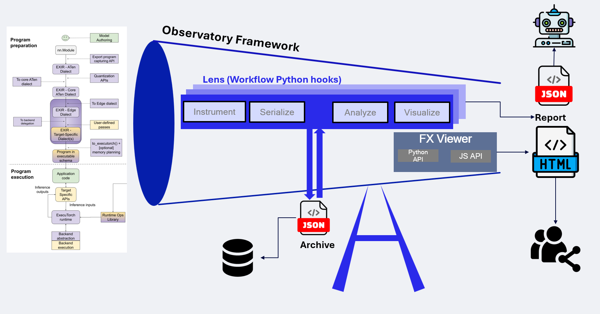
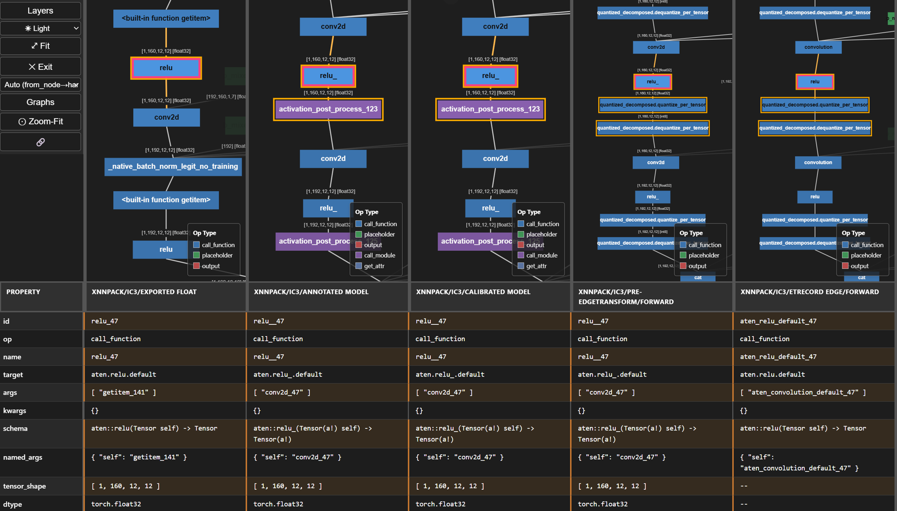
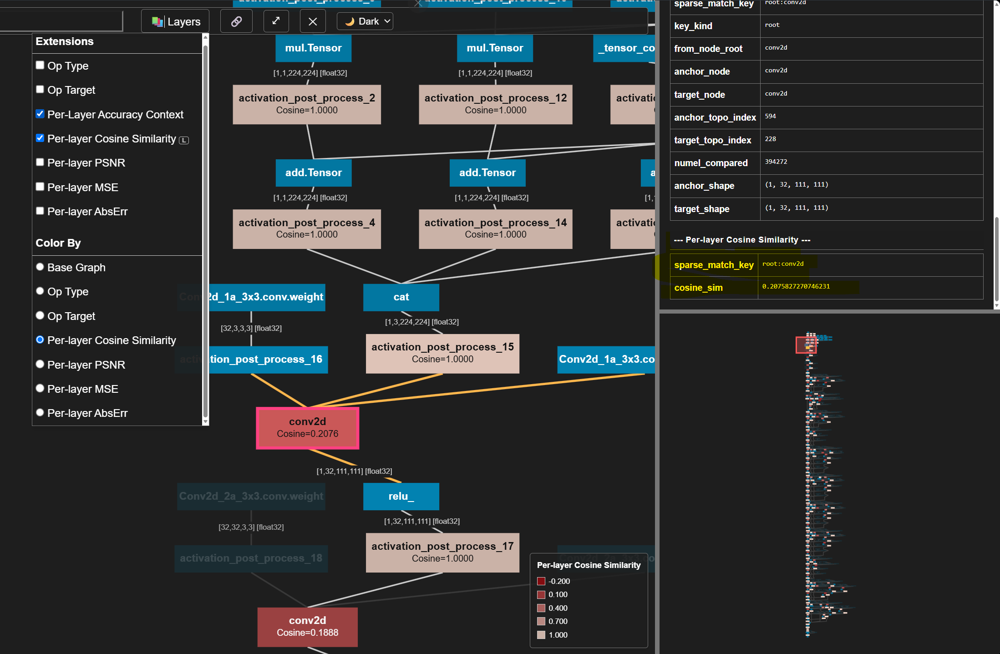
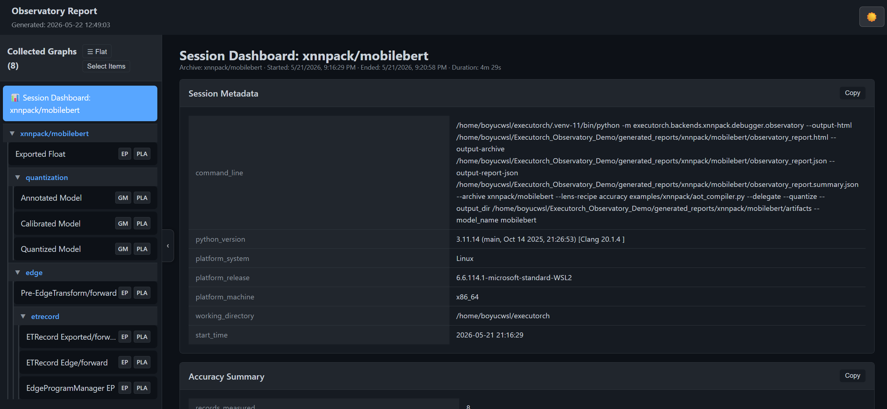
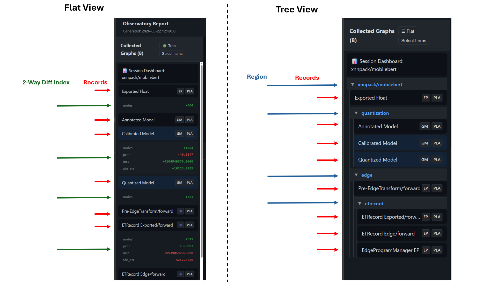
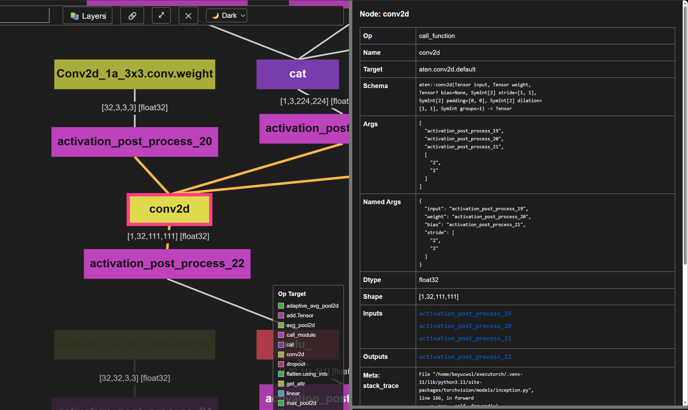
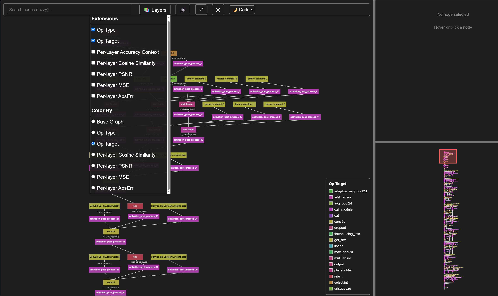
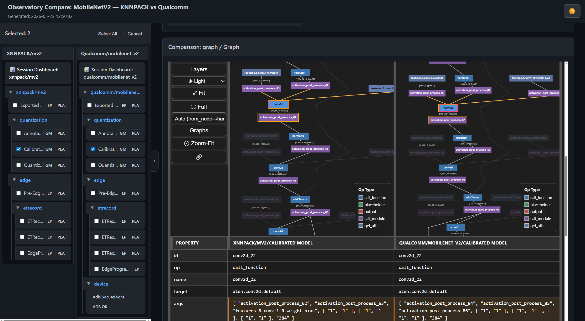

# Proposing a Visualizer and Debugging Framework for ExecuTorch

# 1. Introduction

Today ExecuTorch has no convenient way to compare different graphs and debugging artifacts in one place. This proposal adds two pieces that work together:

1. **`fx_viewer`** — a lightweight, extensible FX-graph viewer. It compares many graphs side by side, and packs dozens of intermediate graphs and other debugging results into a single shareable HTML file.

2. **`Observatory`** — a debugging framework built on top of `fx_viewer`. It manages the debugging workflow so that debug-logic maintainers can write their own hooks (called **Lenses**) for each stage:
   - session setup and teardown (e.g. monkey-patching)
   - artifact collection and serialization
   - data analysis and comparison
   - visualization strategy

With this design, running a debugging workflow and producing a shareable report becomes standardized — and usually needs little or no change to existing scripts. `Observatory` does **not** replace `Inspector`, `ETRecord`, or `ETDump`; it coordinates them. The rest of this document explains the motivation, then describes each piece in detail.



## 1.1 Draft Implementation

A working proof-of-concept that produced every demo and report in this document lives on the draft branch:

> **Draft branch:** _<add link to the draft branch / PR here>_ — see also the detailed PR write-up in `pr_description_refined.md`.

## 1.2 What We Are Proposing (and What Is Open)

We are proposing a **feature set** — backed by a draft implementation to make it concrete and testable. We are **not** asking to lock in a specific module layout or API surface yet. In particular:

- The **feature set and workflow** (the capture/analyze/visualize split, the Lens idea, N-way graph compare, portable HTML/JSON outputs) is what we want to align on.
- The **concrete module hierarchy, directory placement, and exact API framing** shown here are *illustrative* and **open to discussion** — including how `fx_viewer` and `Observatory` should relate to existing tools (Model Explorer, `Inspector`) and where they should live in the tree.

We welcome different integration and contribution strategies. The decisions we are actively seeking input on are collected in **§5 (Open Questions)**, and are also flagged inline where they first come up.

# 2. Motivation & Approach

## 2.1 Why `fx_viewer`? The Graph Needs a Lightweight, Workflow-Aware Viewer
The `torch.fx` graph is ExecuTorch's core IR. ExecuTorch already ships a Model Explorer integration (`devtools/visualization/`) for browsing it, and Model Explorer is a powerful, mature tool.

`fx_viewer` is **complementary, not a replacement**. The two serve different jobs:

- **Model Explorer** — general model browsing.
- **`fx_viewer`** — one job Model Explorer does not cover well: debugging a model *inside* the compile pipeline, across many stages at once.

For that in-pipeline workflow, a few of Model Explorer's design choices add friction. The groups below pair each need with how `fx_viewer` meets it.

#### 2.1.1 Compare many graphs at once
*To trace a lowering, you often need to view several stages together, not just two.*

| Aspect | Model Explorer (ExecuTorch integration) | `fx_viewer` |
|---|---|---|
| Graphs compared at once | 2 (split-pane) | N-way (3 or more) in one grid |
| Node sync across panes | GUI only; matches by exact node id. Many-to-many sync needs a mapping JSON written and uploaded by hand. | Automatic, including many-to-many, from `from_node_root` lineage and `debug_handle` |

#### 2.1.2 Show your own data on the graph
*The graph is the natural place to show accuracy, partitions, and hardware limits.*

| Aspect | Model Explorer | `fx_viewer` |
|---|---|---|
| Custom per-node data | ExecuTorch only sets node *namespace* for grouping. Other values (accuracy, latency) need a separate node-data JSON, and only op nodes are supported. | Set programmatically; colors, labels, and any per-node data are baked into one payload |





#### 2.1.3 Share the result easily
*A debugging view should attach to a GitHub issue or PR as a single file.*

| Aspect | Model Explorer | `fx_viewer` |
|---|---|---|
| How you view it | Starts a local `model-explorer` server and opens a browser tab; a saved JSON still needs the server to open it | One standalone HTML file, opens in any browser, no server |
| Shareable in an issue/PR | No (needs a server; local permalinks do not work elsewhere) | Yes (just send the HTML file) |

#### 2.1.4 Stay small and easy to extend
*A backend team should be able to read and change the viewer itself.*

| Aspect | Model Explorer | `fx_viewer` |
|---|---|---|
| Open to contributions | Owned by an external team; ExecuTorch cannot land viewer changes directly | Lives in ExecuTorch devtools; small and easy to extend |
| Frontend stack | Angular + three.js + d3 (~50k lines of frontend TS/HTML/SCSS) | Plain JavaScript on HTML5 Canvas (~4.5k lines, no framework) |
| Graph layout | Computed in the browser on each load, which gets slow on large graphs | Pre-computed in Python and baked into the HTML, so it is expected to render faster on open *(head-to-head numbers still to be measured)* |

## 2.2 Why `Observatory`? The Debugging Workflow is Fragmented
ExecuTorch already has strong low-level capture tools (`Inspector`, `ETRecord`/`ETDump`), but no layer to *coordinate* them. So each backend builds its own glue, and the results are hard to share and reuse. The groups below show each problem and how `Observatory` solves it.

#### 2.2.1 Write the debug logic once, reuse it everywhere
*The same setup, collect, analyze, and clean-up steps should not be rebuilt per backend.*

| Problem today | How `Observatory` solves it |
|---|---|
| Each backend writes its own wrapper script to start, collect, analyze, and stop | A **Lens** holds one debugging concern; the framework runs the session lifecycle, storage, and report assembly |
| Analysis logic is locked inside one backend's script | Lenses are reusable and opt-in, so the same analysis runs across backends |

#### 2.2.2 Turn scattered output into one shareable report
*Findings should live in one place, for both people and CI.*

| Problem today | How `Observatory` solves it |
|---|---|
| Output is split across console prints, CSV files, and screenshots | One self-contained HTML report for people, plus structured JSON for CI and automated triage |

#### 2.2.3 Re-analyze and compare without re-running
*You should not have to re-run the compiler to ask a new question later.*

| Problem today | How `Observatory` solves it |
|---|---|
| You cannot re-analyze or compare past runs without running the compiler again | Capture is split from analysis: a lightweight **Archive JSON** is saved during the run, so you can re-analyze it later or compare two runs with `--compare`, with no re-run |

## 2.3 Relationship to Existing Tools (Open for Discussion)
The sections above motivate the *features*, not a fixed integration plan. How `fx_viewer` and `Observatory` should sit next to ExecuTorch's existing tools is something we want reviewers to shape:

- **vs. Model Explorer (`devtools/visualization/`):** we treat `fx_viewer` as *complementary* (in-pipeline debugging) rather than a replacement (general browsing) — but whether to ship a second viewer or push these features upstream into Model Explorer is open. See **§5, Q1**.
- **vs. `Inspector` / `ETRecord` / `ETDump`:** `Observatory` is a *client* that coordinates these, not a replacement — but where it should live in the tree and who owns it is open. See **§5, Q4**.

We are happy to adopt a different module layout or integration strategy if reviewers prefer it.

# 3. User-Facing Surfaces and Outputs

This section is the concrete proposal: what you trigger, how you extend it, and what you get back. Observatory has two kinds of surface, for two audiences:

- **Consumers** who *run* debugging (CI engineers, bug reporters, pass authors) trigger a run.
- **Maintainers** who *extend* debugging with new analysis write a **Lens**.

`fx_viewer` is the glue: a lens turns its analysis into the interactive graph that the consumer sees in the report.

```
  CONSUMER triggers a run               MAINTAINER extends with a Lens
 ┌───────────────────────┐            ┌────────────────────────────────┐
 │ 1. CLI wrapper        │            │ class MyLens(Lens):            │
 │ 2. context + collect  │            │   observe / digest  (capture)  │
 │    (@observe_pass =   │            │   analyze           (compute)  │
 │     sugar over these) │            │   get_frontend_spec (view)     │
 └──────────┬────────────┘            └───────────────┬────────────────┘
            │                                          │
            ▼                                          │
      Observatory coordinates  ◄──── lenses plug in ───┘
            │
            ▼
   Archive JSON  •  Report HTML (fx_viewer UI)  •  Report JSON
```

**Walkthrough video:** a full end-to-end run — zero-config script, the generated report, and the interactive `fx_viewer` graph — is shown here: [walkthrough_from_issue.mp4](demo_material/walkthrough_from_issue.mp4).

## 3.1 Surfaces for Running Debugging
*There are really two surfaces: the CLI, and an in-code "context + collection point" pair. The `@observe_pass` decorator is just syntactic sugar that inserts collection points around a compiler pass for you.*

| Surface | What it is | When to use it |
|---|---|---|
| **CLI wrapper** | Runs an existing script with zero edits; internally opens a context and enables the chosen lenses | CI, bug reproduction, anything you don't want to modify |
| **Context + collection points** | `with Observatory.enter_context(...)` opens a session; `Observatory.collect(name, gm)` records an artifact | In-code control over exactly what and when to capture |
| **`@observe_pass`** *(sugar)* | Wraps a pass so its input and output graphs are `collect()`-ed automatically | Trace one compiler pass without writing `collect()` calls by hand |

**1. CLI** — the zero-change path. It runs your normal script and produces a report. Everything before the script name configures Observatory; everything from the script name onward is your original command, forwarded unchanged:

```bash
python -m executorch.backends.xnnpack.debugger.observatory \
    --output-html report.html \
    --lens-recipe accuracy \
    examples/xnnpack/aot_compiler.py \
    --model_name=mv2 --delegate --quantize
#   ↑ Observatory flags above                  ↑ your original script + its args below
#   (--output-html, --lens-recipe parsed by      (the script is run as-is via runpy;
#    Observatory)                                  --model_name/--delegate/--quantize
#                                                  are passed straight through to it)
```

Observatory parses only its own leading flags, then runs your script exactly as written and forwards the remaining arguments verbatim — so no edit to the script is needed.

*How the zero-change capture works (this is the concern raised in §5, Q2):* when the session opens, the `pipeline_graph_collector` lens temporarily replaces a few standard pipeline functions with thin wrappers that call `Observatory.collect()` around the original, then puts the originals back when the session ends. In simplified form:

```python
import torchao.quantization.pt2e.quantize_pt2e as qt   # the module that owns convert_pt2e

_original = qt.convert_pt2e                       # 1. save the real function

def _patched(model, *args, **kwargs):
    Observatory.collect("Calibrated Model", model)        # 2a. capture the input graph
    result = _original(model, *args, **kwargs)            # 2b. call the real function
    Observatory.collect("Quantized Model", result)        # 2c. capture the output graph
    return result

qt.convert_pt2e = _patched                        # 3. install for this session
# ... on session end: qt.convert_pt2e = _original  (always restored, even on exception)
```

The same pattern wraps `prepare_pt2e` and `to_edge_transform_and_lower`. The patched set is a small, explicit list owned by one lens, and every original is restored on exit. This is what makes "zero code change" possible — and also what **Q2** asks reviewers to weigh in on.

**2. Context + collection points** — the underlying mechanism the CLI uses. You activate the lenses you want, open a session, and mark the points to capture. Lenses are turned on (and tuned) by the `config` dict passed to `enter_context`, keyed by lens name:

```python
from executorch.devtools.observatory import Observatory
from executorch.devtools.observatory.lenses import PerLayerAccuracyLens

Observatory.register_lens(PerLayerAccuracyLens)          # make the lens available

# Outer session: accuracy lens ON for the whole run.
with Observatory.enter_context("quantization",
                               config={"per_layer_accuracy": {"enabled": True}}):
    Observatory.collect("before_quantize", gm)           # capture point 1

    # Inner region: override config locally (e.g. turn the lens OFF for a
    # fast sub-step). Overrides are pushed on enter and popped on exit.
    with Observatory.enter_context("fast_passes",
                                   config={"per_layer_accuracy": {"enabled": False}}):
        gm = run_cheap_passes(gm)

    quantized_gm = quantize_model(gm)
    Observatory.collect("after_quantize", quantized_gm)  # capture point 2
```

Capture and reporting are **two separate stages**, so you can persist the raw run once and render (or re-render) reports later without re-running the compiler:

```python
# Stage 1 — persist the raw run as a lightweight Archive JSON.
Observatory.export_json("archive.json")

# Stage 2 — render HTML from that archive, any time, with no re-run.
Observatory.generate_html_from_json("archive.json", "report.html")
```

`@observe_pass` is sugar over this: decorating (or wrapping) a pass simply inserts a `collect()` before and after its `call()`, so no manual collection points are needed.

```python
from executorch.devtools.observatory import observe_pass

observed_passes = [observe_pass(p) for p in [FoldQDQ(), LayoutTransform()]]
```

## 3.2 The Lens Protocol: Surface for Extending Debugging
*To add a new debugging concern, a maintainer writes one Python class and implements only the stages it needs. The framework handles the rest.*

| Stage | Hook | What it does |
|---|---|---|
| Capture | `observe` / `digest` | Intercept an artifact at each `collect()` call and store a JSON-serializable form |
| Analyze | `analyze` | Compute derived results across all records, once, at report time |
| Visualize | `get_frontend_spec` | Declare the report blocks this lens contributes (table, HTML, or graph overlay) |
| Session | `on_session_start` / `on_session_end` | (Optional) install and restore monkey-patches for the run |

### 3.2.1 How a lens contributes a graph view with `fx_viewer`
The visualize stage is where a lens meets `fx_viewer`. A lens declares a **`GraphBlock`** (an interactive FX graph) and attaches one or more **`GraphExtension`** layers — togglable overlays of colors, labels, and per-node data drawn on top of the graph. Many extensions can sit on the same graph, so one graph can show op type, partition, and accuracy as separate switchable layers.

Here is the *essence* of an **accuracy lens** — capture per-node metrics, analyze them, then return both a table and a graph for each record. The whole overlay (colors, labels, per-node data, cross-graph sync) is built in Python, with no JavaScript:

```python
class PerLayerAccuracyLens(Lens):
    # session hooks install/restore patches; omitted here — see PR description

    @classmethod
    def observe(cls, artifact, ctx):                 # CAPTURE (online)
        if not is_graph_like(artifact):
            return None                              # skip records this lens ignores
        return evaluate_per_node(artifact, cls._float_model)   # {node_id: {psnr, ...}}

    @staticmethod
    def analyze(records, config):                    # ANALYZE (offline)
        ...                                          # e.g. rank nodes by degradation

    # VISUALIZE (offline): each record returns a TABLE + the GRAPH with an overlay layer
    class _Frontend(Frontend):
        def record(self, digest, analysis, context):
            metrics = digest["per_layer_accuracy"]
            table = TableBlock(id="accuracy_table", rows=worst_nodes_table(metrics))
            ext = GraphExtension(id="per_layer_accuracy", name="Per-Layer Accuracy")
            for node_id, m in metrics.items():
                ext.add_node_data(node_id, {"psnr_db": f"{m['psnr']:.2f}"})
            ext.set_color_rule(NumericColorRule(attribute="psnr_db", cmap="reds"))
            ext.set_sync_key("from_node")            # sync nodes across graphs in compare
            graph = GraphBlock(id="fx_graph", extensions=[ext])
            return ViewList(blocks=[table, graph])   # table + graph, in order
```

For each record this one lens contributes two blocks: a **`TableBlock`** summary and a **`GraphBlock`** carrying its `GraphExtension` overlay. The framework owns *when* each hook fires and *what* the Archive stores; the lens owns only the question it answers. The result: a summary table plus nodes colored by accuracy, labeled with their metric, full values in the info panel, and synced across graphs in compare mode.

> **Full detail in the PR description.** The complete eight-method Lens protocol (`setup` / `on_session_start` / `on_session_end` / `observe` / `digest` / `analyze` / `html_frontend` / `json_frontend`) and a full worked custom lens (`AdbLogLens`) live in `pr_description_refined.md` (§"The Lens Protocol" and §"Worked Example").

## 3.3 What You Get Out
*Capture and analysis are kept separate, so one run produces one raw file and two derived views.*

| Output | For whom | What it is |
|---|---|---|
| **Archive JSON** | Storage / replay | Raw `sessions[]` + `records[]`, no analysis baked in — lightweight, ideal for CI (it is also one of the proposed stable schemas; see Q3) |
| **Report HTML** | People | One self-contained, server-free dashboard with the interactive `fx_viewer` graph; shareable in a PR or email |
| **Report JSON** | CI / LLM triage | Structured metrics and flagged regressions for automated gates |

**Demo images:**

- **Session dashboard** — run metadata: command line, environment, models, and active lenses.
  
- **Record tree explorer (left panel)** — captured records nested by pipeline region; flat vs. folder views.
  
- **Interactive layered graph** — the canvas with minimap and search; a node selected, with its detail panel open.
  
- **Color-by overlay + layer toggle** — nodes painted by an accuracy metric (green→red gradient), with the layer/color-by control visible.
  
- **Cross-backend compare (N-way sync)** — two graphs side by side; selecting a node in one highlights and centers the matched node in the other.
  


**Live reports — normal (single-run) mode:**

| Backend | Model | Nodes | Report |
|---|---|---:|---|
| xnnpack | `mobilebert` | 2361 | [HTML Report](https://quic-boyuc.github.io/Executorch_Observatory_Demo/generated_reports/xnnpack/mobilebert/observatory_report.html) |
| xnnpack | `resnet50` | 550 | [HTML Report](https://quic-boyuc.github.io/Executorch_Observatory_Demo/generated_reports/xnnpack/resnet50/observatory_report.html) |
| xnnpack | `mv2` | 521 | [HTML Report](https://quic-boyuc.github.io/Executorch_Observatory_Demo/generated_reports/xnnpack/mv2/observatory_report.html) |
| qualcomm | `swin_v2_t` | 1494 | [HTML Report](https://quic-boyuc.github.io/Executorch_Observatory_Demo/generated_reports/qualcomm/swin_v2_t/observatory_report.html) |
| qualcomm | `mobilenet_v2` | 521 | [HTML Report](https://quic-boyuc.github.io/Executorch_Observatory_Demo/generated_reports/qualcomm/mobilenet_v2/observatory_report.html) |

*(Each report folder also contains a machine-readable JSON summary and the raw run log.)*

**Live reports — compare mode (same model, XNNPACK vs. Qualcomm QNN):**

| Model | Backend Pair | Comparison HTML |
|---|---|---|
| MobileNetV2 | `xnnpack/mv2` vs `qualcomm/mobilenet_v2` | [HTML Comparison](https://quic-boyuc.github.io/Executorch_Observatory_Demo/generated_reports/comparisons/xnn_mv2_vs_qnn_mobilenet_v2/observatory_comparison.html) |
| MobileNetV3 | `xnnpack/mv3` vs `qualcomm/mobilenet_v3` | [HTML Comparison](https://quic-boyuc.github.io/Executorch_Observatory_Demo/generated_reports/comparisons/xnn_mv3_vs_qnn_mobilenet_v3/observatory_comparison.html) |
| InceptionV3 | `xnnpack/ic3` vs `qualcomm/inception_v3` | [HTML Comparison](https://quic-boyuc.github.io/Executorch_Observatory_Demo/generated_reports/comparisons/xnn_ic3_vs_qnn_inception_v3/observatory_comparison.html) |
| InceptionV4 | `xnnpack/ic4` vs `qualcomm/inception_v4` | [HTML Comparison](https://quic-boyuc.github.io/Executorch_Observatory_Demo/generated_reports/comparisons/xnn_ic4_vs_qnn_inception_v4/observatory_comparison.html) |
| ViT | `xnnpack/vit` vs `qualcomm/torchvision_vit` | [HTML Comparison](https://quic-boyuc.github.io/Executorch_Observatory_Demo/generated_reports/comparisons/xnn_vit_vs_qnn_torchvision_vit/observatory_comparison.html) |

*(Each comparison folder also contains a summary JSON and a comparison log.)*

# 4. Scope & Stability

This section states what already exists, what this RFC asks to approve, what is planned later, and which parts are meant to be stable contracts.

## 4.1 What's in the proposal, and what's planned later
Everything described in this RFC is **already implemented as a proof-of-concept** in the draft branch — the same code that generated all the demos and reports above. The POC exists to make the proposal concrete and reviewable; it is **not** production-ready, and the whole branch still needs thorough review before any part is merged. The table below separates **what the POC covers today** from **what is left as future work**.

| Area | In the POC (proposed in this RFC) | Future work |
|---|---|---|
| **Core** | Context manager, `@observe_pass`, region tree view, session lifecycle, Archive-JSON reload, Lens protocol hooks | Nightly CI regression templates |
| **Lenses** | Compile-time accuracy, FX graph capture, stack-trace, metadata, pipeline patches, Report JSON (machine summary) | Runtime/delegated accuracy, backend profiling, QParam audit |
| **`fx_viewer`** | Pan/zoom/minimap, search, N-way node sync, multi-layer overlays, Python (build) + JS (runtime) API boundaries | Non-FX formats (TOSA, JIT, delegated graphs) |
| **CLI** | Backend + generic wrappers, `--compare` mode (archive → regression report) | Live streaming-telemetry dashboard |

## 4.2 Ownership and stable surfaces
Ownership is split so backends can move fast without core sign-off:

- **Core devtools** own `devtools/observatory/` and `devtools/fx_viewer/`, the Lens protocol, and generic lenses (graph, metadata, compile-time accuracy).
- **Backend teams** own their own `backends/<name>/debugger/observatory/` directory — including backend patches, custom lenses, and the **backend-specific CLI wrapper** (e.g. `python -m executorch.backends.qualcomm.debugger.observatory`). They maintain these without core sign-off.

To protect downstream tooling and CI, four surfaces are treated as **stable, change-controlled contracts**. Breaking changes to them must be announced and staged with backward-compatible aliases where feasible:

1. The **Lens protocol** hook signatures
2. The **`GraphExtension`** Python API
3. The **Archive JSON** schema
4. The **Report JSON** schema *(proposed)*

# 5. Open Questions for Reviewers

We are seeking decisions on the following. Each question ends with a starting recommendation that reviewers can accept, amend, or reject. As noted in **§1.2**, the feature set is what we want to align on — the module layout and integration strategy below are open. Q1 and Q4 are first raised in **§2.3** (relationship to existing tools); Q2 is first raised in **§3.1** (the zero-change capture mechanism).

**Q1 — Should `fx_viewer` exist beside Model Explorer, or should these capabilities go upstream into it?**
The motivation section argues that Model Explorer does not fit the in-pipeline, multi-stage compiler-debugging workflow (2-pane only, server-backed, manual sync/overlay files, closed to contribution). The fork in the road: add `fx_viewer` as a second, lightweight viewer in devtools for this use case, or instead push these features (N-way compare, programmatic overlays, standalone HTML) upstream into Model Explorer?
*Recommendation:* add `fx_viewer` for the compile-debugging use case and keep Model Explorer for general model browsing. The two serve different stages and the doc treats them as complementary, not competing. Revisit upstreaming once the API boundaries are stable.

**Q2 — Is monkey-patching pipeline entry points an acceptable capture mechanism, or do we need official pipeline hooks?**
The "zero code change" CLI works by patching standard functions (`prepare_pt2e`, `convert_pt2e`, `to_edge_transform_and_lower`, ...) for the duration of a session, then restoring them — see the concrete before/after wrapper in *"How the zero-change capture works"* above. This is powerful but couples capture to internal function signatures, which can drift across ExecuTorch versions. Should patching stay the supported mechanism, or should ExecuTorch expose official observation hooks that lenses attach to instead?
*Recommendation:* keep scoped patching for v1: it needs no core changes and is fully restored on session end. But treat the patched entry points as a small, explicit list owned by the `pipeline_graph_collector` lens, so a future migration to official hooks stays localized. Heavy lenses (e.g. accuracy simulation that runs real inference during compile) stay opt-in via lens recipes.

**Q3 — Are we ready to treat the Lens protocol and the JSON schemas as stable contracts, and where is the core/backend line?**
The proposal designates the Lens protocol, `GraphExtension` API, Archive JSON, and Report JSON as stable surfaces, and splits ownership between `devtools/` (core) and `backends/<name>/debugger/observatory/` (backends). Two sub-questions: (a) do we commit to these schemas as stable now, or keep them experimental until more backends adopt them? (b) is the binary core/backend split enough, or do we need a middle tier for lenses shared by a few backends?
*Recommendation:* mark the **Lens protocol + the two JSON schemas** as the change-controlled surface and the core `graph` / `metadata` lenses as the first stable lenses; default all other lenses to *experimental* until promoted. Keep the binary core/backend split for v1; treat a lens shared by two backends as a core lens they opt into, promoted via a normal core PR with a one-release import shim. Announce breaking changes with an `observatory-api-change` label plus a `CODEOWNERS` entry so backend owners are auto-requested.

**Q4 — Is `devtools/observatory/` the right home in the tree, and who owns it next to `Inspector`?**
The proposal frames Observatory as a coordination layer *above* `Inspector` / `ETRecord` / `ETDump`, and places it at `devtools/observatory/` with `fx_viewer` at `devtools/fx_viewer/`. Since the Inspector team owns the adjacent surface, where should this live — as a sibling under `devtools/`, nested near `inspector/`, or somewhere else — and which team signs off on the core?
*Recommendation:* keep `devtools/observatory/` and `devtools/fx_viewer/` as siblings (they are clients of Inspector, not part of it), with core devtools reviewers owning them and the Inspector owners added to `CODEOWNERS` for any change that touches the Inspector boundary.
